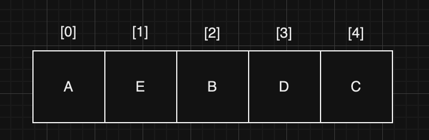
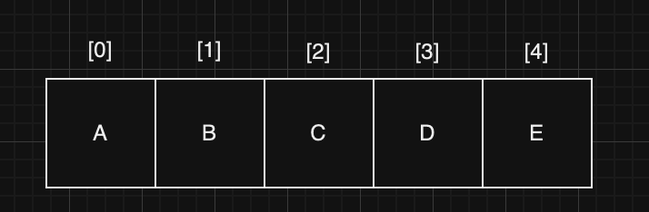

## Array (배열)

### Array

---

- 리스트(목록)을 저장하는 자료 구조
- 데이터를 순차적으로 저장하고, 메모리를 정적으로(정해진 크기, 변경 불가) 할당받는다.
- 배열의 데이터는 연속해야하고, 인접해야 한다. (중간에 비어있는 부분이 있으면 안된다.)
- 인덱스(`index`), 요소(`element`)로 구성된다.
- 장점
    - 검색이 빠르다.(인덱스를 통한 빠른 데이터 접근이 가능하다.)
- 단점
    - 정해진 크기를 변경할 수 없다.   
      (데이터를 크기보다 더 추가하고 싶어도 불가능하고, 적게 추가해도 이미 메모리를 할당받았기 때문에 낭비되는 공간이 생긴다.)
    - 요소의 삽입과 삭제가 오래 걸린다.   
      (삽입/삭제된 요소의 뒷 요소들이 모두 한칸씩 이동해야 하기 때문이다.)

### 동작

---
1. 읽기 : Read
   - 시작 주소를 알고 있고, 인덱스로 접근하기 때문에 매우 빠르다.
   - 많은 데이터를 읽기에 적합하다.
2. 검색 : Search
   - Linear Search (선형 검색)
       - 열의 첫번째부터 찾는 데이터인지 비교하면서 찾는 방법
       - 찾을때까지 처음부터 끝까지 비교하기 때문에 찾는 데이터가 끝쪽애 있을수록(혹은 없는경우) 비교 연산이 많이 이루어진다.
   - Binary Search (이진 검색)   
     
       - 배열을 반으로 나누었을 때 가운데 데이터와 비교하면서 찾는 방법
       - 정렬된 배열에서만 사용 가능하다.
       - 모든 수와 비교하는 것이 아니라 찾는 범위를 좁혀 나가기 때문에 선형 검색보다 빠르다.
       - 정렬된 배열의 삽입, 삭제는 그렇지 않은 배열보다 느리므로 검색이 중요한 경우 이진 검색을 고려해 볼 수 있다.
3. 삽입 : Insert
   - 배열에 새로운 데이터를 추가하는 것인데, 어디에(위치) 추가하는지가 중요하다.
       - 제일 끝자리 : (아직 공간이 남아있다면) 바로 추가하면 된다. 
       - 중간 : 새로운 데이터가 들어갈 자리 뒤를 모두 한칸씩 미뤄야 한다.
       - 앞 : 제일 앞의 데이터부터 모두 한칸씩 뒤로 미뤄야 한다. (최악의 상황)
   - 이미 다 차있다면 기존 배열에는 추가가 불가능하지만   
     크기가 큰 새로운 배열을 만들고 현재 데이터를 모두 옮긴다음 추가하는 것은 가능하다. (복잡, 오래걸림)
4. 삭제 : Delete
   - 기존 데이터를 삭제하는 것인데, 어디에(위치) 있는 데이터를 삭제 하는지가 중요하다.
       - 제일 끝자리 : 바로 찾아서 삭제하면 된다.
       - 중간 : 선택된 데이터를 삭제하고 한칸씩 앞으로 이동해야 한다.
       - 앞 : 가장 앞의 데이터를 삭제하고 모든 데이터를 한칸씩 앞으로 이동해야 한다. (최악의 상황)