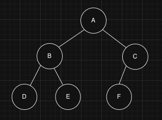

## Heap (힙), Priotity Queue (우선순위 큐)

### Heap (힙)

* * *

- 완전 이진 트리 구조를 가진다.

    - 마지막 레벨의 노드를 제외한 모든 노드가 채워진 트리를 의미한다.
    - 채워졌다는 것은 왼쪽에서부터 채워진 것을 말하며, 오른쪽 노드가 있으면 왼쪽 노드는 반드시 존재해야 한다.

- 데이터의 중복을 허용한다.

- 일반적으로 부모 노드가 자식 노드보다 항상 크거나 같고, 작거나 같은 값을 가진다.

    

    - 최소 힙(Min Heap) : 부모 노드가 자식 노드보다 작거나 같은 값을 가지는 경우
    - 최대 힙(Max Heap) : 부모 노드가 자식 노드보다 크거나 같은 값을 가지는 경우

- 일반적으로 배열로 구현된다.

    

    - 배열의 0번은 비어있고, 1번부터 시작한다.
        - 1번으로 시작하면, 부모 노드는 자식 노드의 인덱스를 2로 나눈 값이 되어 부모/자식의 인덱스를 구하기 좋기 때문이다.
        - 부모노드의 인덱스가`i`일 때,왼쪽 자식노드의 인덱스는`2i`이고 오른쪽 자식 노드의 인덱스는`2i+1`이다.

        - 특정 노드의 자식 노드에 접근하거나, 해당 노드의 값에 접근할 때 인덱스를 사용할 수 있다.
    - 힙을 연결리스트로 구현할 수도 있지만, 배열로 구현하는 것보다 효용성이 떨어진다.
        - 배열은 각 노드를 인덱스로 관리하여 원하는 노드를 바로 찾을 수 있는데,연결리스트로 관리하면 노드를 찾는 연산이 추가적으로 필요하기 때문이다.
    - 배열은 동적으로 확장이 가능하다.

> **\[동적 배열\]**  
> 작은 크기의 배열로 시작하여 데이터가 더 추가되는 경우에 더 큰 크기의 배열을 할당받고 전체 데이터를 이동하는 방식이다.  
> (필요에 따라 크기를 늘리고, 줄이기도 한다.)

- 삽입, 삭제의 시간복잡도 :`O(logN)`
    - 삽입  
      
        - 새로운 요소를 노드의 마지막에 추가한다.
        - 추가된 노드를 부모 노드와 비교하며 위치를 찾아 이동한다.
        - 자신의 위치를 찾을 때까지 or 루트 노드에 도달할 때까지 반복한다.
    - 삭제  
      
        - 루트 노드를 제거한다.

        - 힙의 마지막 요소를 루트 노드로 이동시킨다.
        - 루트 노드를 자식 노드들과 비교하며 위치를 찾아 이동한다.
            - 최대 힙인 경우 더 큰 값을 가지는 자식 노드와, 최소 힙인 경우 더 작은 값을 가지는 자식 노드와 위치를 변경한다.
        - 자신의 위치를 찾을 때까지 or 리프 노드에 도달할 때까지 반복한다.
    - 일반적으로 배열의 삽입 삭제는 특정 위치에 데이터를 추가하고 그 뒤의 데이터를 한칸씩 이동시키는 연산이 추가되는데,   
      힙은 배열로 구성되어 있지만 위치를 찾아가면서 이동하는 연산을 함께 진행하기에 시간복잡도는 트리의 레벨에 비례하여 `O(logN)`이 된다.

- 주로 우선순위 큐를 구현하는데 사용되지만, 정렬 알고리즘 (힙 정렬)으로도 사용할 수 있다.

### 우선순위 큐

* * *

- 저장한 데이터를 우선순위에 따라 정렬하여 보관하고,   
  추출시에는 우선순위에 따라 추출을 진행하는 자료구조이다.
- 일반적으로 큐는 먼저 들어온 데이터가 먼저 추출되는 구조(FIFO)인데,   
  우선순위 큐는 데이터가 삽입되면 각 데이터가 가지고 있는 우선순위에 따라 순서를 정렬하고, 이 순서에 따라 데이터를 추출한다.

- 우선순위는 일반적으로 숫자로 정의되지만,   
  일부 시스템에서는 문자열(ex. ”높음", “중간", “낮음")로 표현하기도 하고, 사용자가 직접 정의한 형식으로 표현하기도 한다.

- 우선순위 큐는 일반적으로 힙 구조이며, 힙은 배열로 구현할 수 있다.
    - 최대 힙에서는 큰 값이 우선순위가 되고, 최소 힙에서는 작은 값이 우선순위가 된다.
    - 부모 노드가 자식 노드보다 우선순위가 높다.

- 데이터의 삽입, 삭제, 우선순위 변경 등의 연산을 빠르게 수행할 수 있다.
    - 삽입, 삭제의 시간 복잡도 : `O(logN)`
        - 힙의 삽입, 삭제

    - 우선순위 변경의 시간 복잡도 : `O(logN)`
        - 변경할 노드의 위치를 찾아 이동

- 응용
    - 작업 스케쥴링
    - 이벤트 처리
    - 네트워크 트래픽 관리