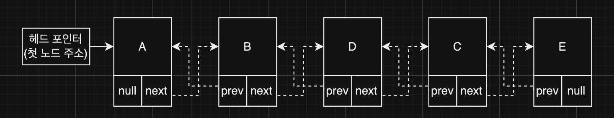

## Linked List (연결 리스트)

### Linked List

---

- 리스트(목록)을 저장하는 자료 구조
- 데이터가 순차적으로 연결되어 있다.
- 크기가 정해진 배열과 달리 확장이 가능하다.
- 노드(`Node`)로 구성되어 있다.
- 노드는 데이터를 저장하는 부분(값)과, 다음 노드를 가리키는 포인터 정보(포인터)로 이루어져 있다.
- 접근 시에 위치에 따른 이동시간이 발생한다.
- 종류
    - Singly Linked List (단방향 연결 리스트)
        - 다음 노드(`next`)를 가리키는 포인터 필드만 가지고 있다.
        - 이전 요소로 접근해야 할때는 한바퀴를 돌아 와야 하는 불편함이 있다.
    - Doubly Linked List (양방향 연결 리스트)   
      
        - 이전 노드(`prev`)와 다음 노드(`next`)를 가리키는 포인터 필드를 모두 가지고 있다.
        - 각 요소에 대한 접근이 보다 쉬워진다.
        - 자바의 LinkedList 컬렉션 클래스는 양방향 연결 리스트로 구현되어 있다.

- 장점
    - 확장에 용이하다. (미리 정해진 크기의 공간을 할당받지 않아도 된다.)
    - 데이터의 삽입, 삭제가 편하다.
    - 포인터 정보를 통해 다음(+이전) 노드를 찾아올 수 있다.
- 단점
    - 포인터 정보를 저장하기 위한 메모리가 추가로 필요하다.
    - 다음 노드는 쉽게 찾아올 수 있지만, 특정 위치의 노드를 탐색하는데에는 많은 연산이 필요하다.

### 동작

---
1. 읽기: Read
   - 노드도 인덱스로 접근이 가능하지만 배열처럼 한번에 찾아가는 것이 아닌, 처음부터 해당 인덱스 만큼 이동하는 걸 의미한다.   
     (2 인덱스의 데이터 읽기 → 처음부터 다음 노드로 2번 이동했을 때의 데이터 읽기)

2. 검색 : Search
   - Linear Search (선형 검색)
       - 첫번째 노드부터 찾는 데이터인지 비교하면서 찾는 방법
       - 찾을때까지 처음부터 끝까지 비교하기 때문에 찾는 데이터가 끝쪽애 있을수록(혹은 없는경우) 비교 연산이 많이 이루어진다.

3. 삽입 : Insert
   - 추가할 노드의 주변(앞/뒤) 포인터를 추가하는 노드와 연결되도록 수정하면 된다.
       - (추가하는 노드를 A라 하자)
       - 제일 끝자리 : 끝 노드를 알고 있다면 바로, 모른다면 끝까지 검색 연산을 진행히여 찾고 끝 노드의 포인터가 A를 바라보게 연결한다.   
         (양방향인 경우, A의 앞 포인터를 원래의 끝 노드를 바라보게 함께 연결)
       - 중간 : 현재 A를 추가할 위치에 있는 노드를 검색 연산을 통해 찾고, A의 포인터가 찾은 노드를 바라보게 연결한다.  
         그리고 찾은 노드를 바라보고 있던 포인터를 A를 바라보게 변경한다.  
         (양방향인 경우, A의 앞 포인터를 찾은 노드의 앞 노드를 바라보게 연결하고, 해당 노드의 뒷 포인터가 A를 바라보게 연결)
       - 앞 : A의 포인터가 현재 가장 앞의 노드를 바라보게 연결하고, 헤드 포인터를 A를 바라보게 변경한다.   
         (양방향인 경우, A의 앞 포인터는 null로, 원래 가장 앞에 있는 노드의 앞 포인터는 A를 바라보게 연결)

4. 삭제 : Delete
   - 삭제할 노드의 주변(앞/뒤) 포인터를 서로 연결되도록 수정하면 된다.
       - (삭제하는 노드를 A라 하자)
       - 제일 끝자리 : A(끝 노드)를 알고 있다면 바로, 모른다면 검색 연산한 후에 A보다 한칸 앞의 포인터를 null 로 변경하면 된다.
       - 중간 : A의 위치를 찾고 그 앞의 노드의 포인터가 A의 뒤 노드를 바라보게 변경한다.   
         (양방향인 경우, A의 뒤 노드가 A의 앞 노드를 바라보게 변경한다.)
       - 앞 : 헤드 포인터가 두번째 노드를 가리키도록 연결한다.   
         (양방향인 경우, 두번째 노드의 앞쪽 포인터를 null 로 변경)
   - 연결을 변경하면 해당 링크드리스트에서는 빠지지만 노드 자체가 삭제되는 것은 아니다.
       - 메모리 관리를 위해 노드 삭제 작업도 진행해 주어야 한다.