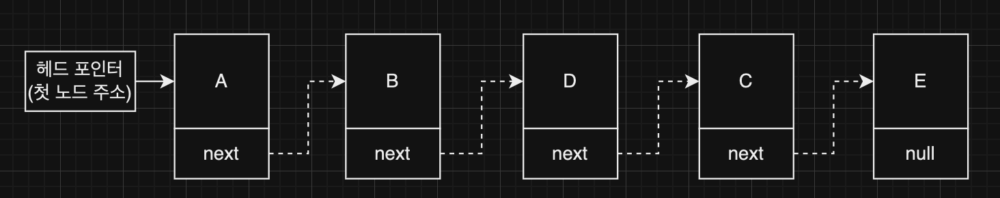

## Linked List (연결 리스트)

### 연결리스트란

---

- 여러 데이터를 순차적으로 저장하며, 각 데이터가 다음 데이터를 가리키는 방식으로 연결된 자료 구조이다.
- 실제 메모리 상에서 데이터는 각각 독립된 공간을 할당받아 저장된다.
- 각 데이터는 노드(`Node`)로 구성되어 있다.
    - 노드는 데이터 값과 다음 노드의 위치(메모리 주솟값)를 가지고 있다.
    - 주솟값은 포인터라고 부른다.
- 크기가 정해져있지 않아 확장이 가능하다.

### 종류

---

#### 1. Singly Linked List (단방향 연결 리스트)

- 다음 노드(`next`)를 가리키는 포인터를 가지고 있다.
- 이전 노드에 접근해야 할 때는 한 바퀴를 돌아서 와야 하는 불편함이 있다.

#### 2. Doubly Linked List (양방향 연결 리스트)
 

- 이전 노드(`prev`)와 다음 노드(`next`)를 가리키는 포인터를 모두 가지고 있다.
- 단방향 연결 리스트보다 쉽게 이전 노드에 접근이 가능하다.

### 장점

---

- 확장에 용이하다.
    - 전체 크기가 정해져 있지 않아, 데이터를 계속 추가할 수 있다.
- 데이터의 삽입, 삭제에 용이하다.
    - 삽입/삭제할 노드에 인접한 노드의 포인터만 변경해 주면 되기 때문에
      삽입/삭제를 보다 편리하게 처리할 수 있다.

### 단점

---

- 데이터 값 이외에 포인터를 저장하기 위한 메모리 공간이 추가로 필요하다.
- 연결된 데이터에 접근하는 데는 용이하지만, 특정 위치의 노드를 찾는 데에는 많은 연산이 필요하다.

### 동작

---

#### 1. 읽기 (Read)
- 시간 복잡도: `O(N)`
- 한 번에 특정 위치의 데이터를 읽을 수 없기 때문에 검색을 통해 데이터를 찾은 후 읽어야 한다.
- 읽기 연산 = 검색 연산

> **시간 복잡도란,**
데이터를 읽거나 검색하거나 삽입/삭제하는 등의 **동작이 완료되기까지 얼만큼의 연산이 필요한지를 데이터의 개수와 비교하여 계산**한 것이다.
>
>시간 복잡도는 보통 **빅오표기법**과 같은 수학적 표기법을 통해 나타내며, 이를 통해 어떤 상황에서 어떤 자료구조/알고리즘이 더 좋을지 판단해 볼 수 있다.
>
>시간 복잡도는 데이터의 위치, 상황에 따라서도 달라질 수 있는데, 빅오표기법은 **가장 최악의 상황(연산이 가장 많이 필요한 상황)** 을 계산하여 표현하는 것이다. 가장 최악의 상황으로 계산하는 이유는, 동작의 모든 경우의 수를 포함하기 위함이다.
>
>빅오표기법은 데이터의 개수가 `n`개일 때, 개수와 관계없이 일정 횟수의 연산을 수행해야 한다면 `O(1)`, 데이터의 개수만큼 연산을 수행해야 한다면 `O(n)` 으로 표현할 수 있다.
>이때 `O(1)`이 `O(n)`보다 시간 복잡도가 낮다고 표현할 수 있으며,
>**시간 복잡도가 낮은 경우에 더 빠른 동작이 가능**하다고 볼 수 있다.

#### 2. 검색 (Search)
- 시간 복잡도: `O(N)`
- 첫 번째 노드부터 찾는 데이터인지 비교하면서 찾는다.
- 찾을 때까지 처음부터 끝까지 비교하기 때문에 찾는 데이터가 연결 리스트의 끝에 있을수록(혹은 없는 경우) 비교 연산이 많이 수행된다.

#### 3. 삽입 (Insert)
- 시간 복잡도: `O(1)`   
  (삽입할 위치에 대한 검색이 추가로 필요하다면, `O(N)`)
- 새로운 노드를 저장하고, 인접한 노드의 포인터(링크)만 변경해 주면 된다.
- 위치에 따른 비교 (추가하는 노드를 A라 하자)
    - A를 메모리에 저장하고,
    - 끝: 가장 끝 노드의 포인터를 A의 주솟값으로 변경한다.
    - 중간: 추가할 위치 앞에 있는 노드의 포인터 값을 A의 포인터에 저장하고, 해당 노드의 포인터는 A의 주솟값으로 변경한다.
    - 앞: 헤드 포인터의 값을 A의 포인터에 저장하고, 헤드 포인터는 A의 주솟값으로 변경한다.

#### 4. 삭제 (Delete)
- 시간 복잡도: `O(1)`
  (삽입할 위치에 대한 검색이 추가로 필요하다면, `O(N)`)
- 인접한 노드의 포인터(링크)만 변경해 주면 된다.
- 위치에 따른 비교 (삭제하는 노드를 A라 하자)
    - 끝: A의 앞 노드의 포인터를 null로 변경한다.
    - 중간: A의 앞 노드의 포인터를 A의 포인터 값으로 변경한다.
    - 앞: 헤드 포인터를 A의 포인터 값으로 변경한다.
- 연결을 변경하면 해당 연결 리스트에서는 빠지지만 노드 자체가 메모리에서 삭제되는 것은 아니기 때문에 메모리 관리를 위해 노드 삭제 작업은 따로 진행해 주어야 한다.