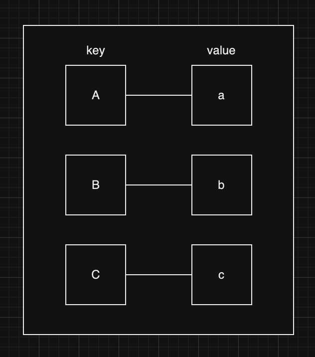
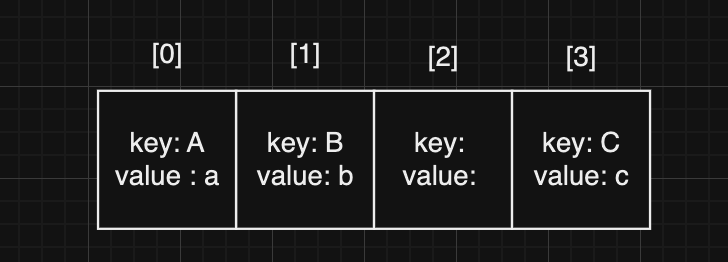
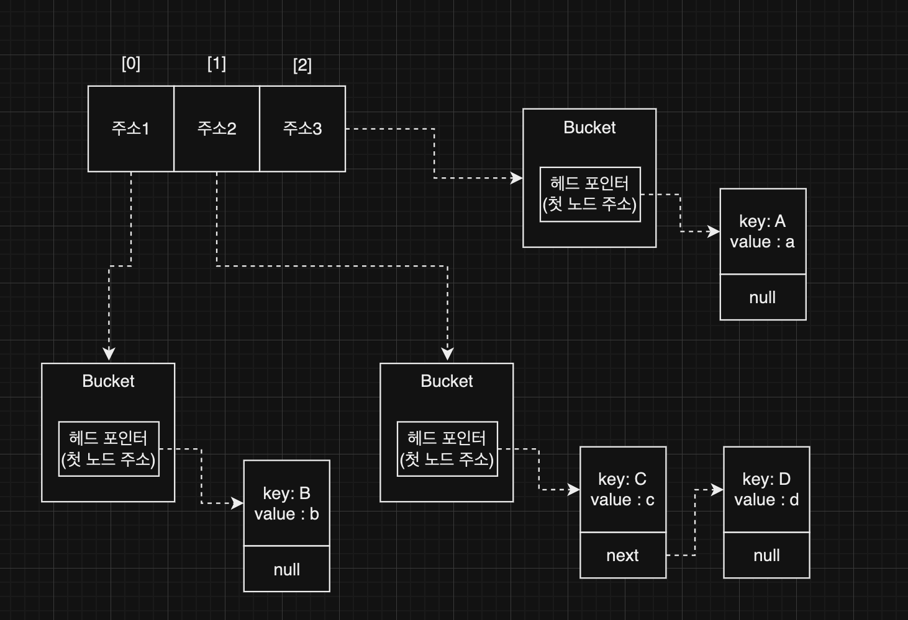
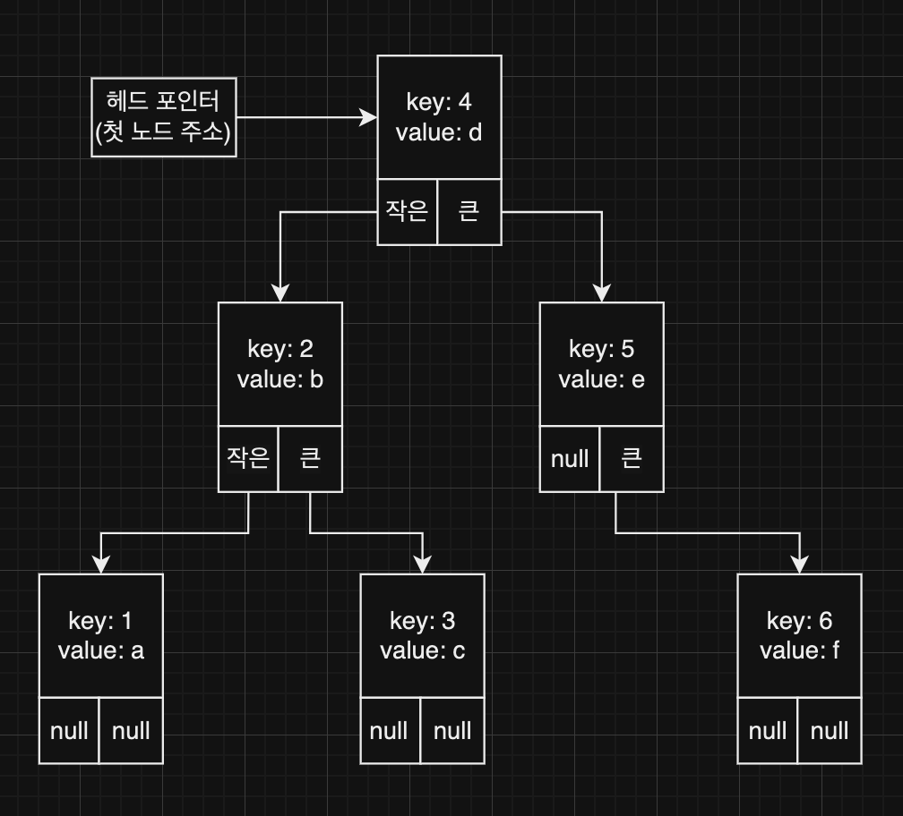

## Map (맵)

### Map

---

- 순서대로 데이터를 저장하지 않고, 키(`key`)와 값(`value`)로 데이터를 저장하는 구조
- value는 key 를 통해 접근한다.
- value는 중복될 수 있지만, key는 중복될 수 없다.   
  (key를 통해 value를 찾는데, key 가 중복된다면 어떤 value를 찾는것인지 알 수 없음)

### 구현

---
1. **Hash Table (해시테이블)**
    - 해시테이블 : 해시값을 인덱스로 가지는 배열
    - 슬롯 : 해시테이블의 요소 (버킷)
    - 저장
        - key값을 해시함수를 통해 변환하여 해시값을 얻는다.
        - key-value로 구성된 버킷을 메모리에 저장한다. (버킷은 여러 구조가 가능)
        - 해시 테이블에 버킷 or 버킷의 메모리 주소를 저장한다.
    - 조회
        - key값을 해시함수에 넘겨 해시값을 얻고, 그를 통해 버킷을 찾아 데이터를 얻는다.
    - 해시 충돌(해시 함수를 통해 얻은 해시값이 같은 데이터가 존재하는 경우)을 해결하는 방법
        - 개방 주소법 (Open Addressing)   
          
            - 해시테이블의 요소는 곧 버킷으로, key-value의 값이 저장되어 있다.
            - 이때, key-value를 담는 구조는 배열/구현체로 구현될 수 있다.
            - 해시 충돌이 일어나는 경우, 비어있는 버킷을 순차적으로(or 이차조사) 찾아 해당 버킷에 데이터를 저장한다.   
              (배열은 연속적이기 때문에 비어있으면 안됨, 배열이 비어있는 것이 아니라 배열에 담긴 버킷이 비어있는 것임)
        - 개별 연결 (Separate Chaining)   
          
            - 해시테이블의 요소에는 각 버킷의 주소값이 담겨있다.
            - 버킷은 헤드포인터(첫번째 노드의 주소값)를 가지고 있다.
            - 각 노드의 데이터에는 key, value 필드가 존재하고 이들은 직접 값을 가지고 있거나, 값을 참조한다.
            - 해시충돌이 일어나는 경우, 같은 버킷의 연결 리스트에 노드를 추가하고 연결한다.

    - 캐시 적중률 : 해시테이블에서 원하는 데이터를 바로 접근할 수 있는 경우의 비율 (충돌을 잘 처리하는 경우 높아짐)
    - 로드팩터 : 해시 테이블에 저장된 데이터의 수 / 해시 테이블의 버킷의 수   
      (로드팩터가 너무 낮으면 메모리 효율이 좋지 못하고, 너무 높으면 성능 저하의 위험이 있다. → 0.7 정도일때 성능이 좋다고 판단함)

2. **Binary Search Tree (이진 탐색 트리)**   
   
    - 이진 탐색 트리의 구조로 key-value 를 저장한다.
    - 왼쪽 서브트리에는 key 값을 기준으로 작은 데이터를, 오른쪽 서브트리에는 key값을 기준으로 큰 데이터를 위치시킨다.
    - key를 기준으로 정렬되어 있어, 데이터의 검색/삽입/삭제 시에 용이하다.

### 해시 테이블과 이진 탐색 트리의 비교

---
- 해시 테이블
    - 장점
        - 평균적으로 조회가 빠르다.   
          (해시 함수를 통해 데이터에 인덱스를 부여하여 관리하기 때문)
        - 메모리 공간을 조금 더 효율적으로 사용할 수 있다.   
          (해시테이블에 버킷 형태로 데이터를 저장하면 개별 포인터를 저장할 메모리가 필요하지 않기 때문)
    - 단점
        - 키의 순서를 보장하지 않기 때문에, 검색을 위해서는 순차/이차 등의 연산을 거쳐야 한다.
        - 해시 충돌이 발생하면 성능이 저하될 수 있다.

- 이진 탐색 트리
    - 장점
        - 데이터를 정렬된 상태로 유지하여, 검색이 용이하다.
        - 탐색, 삽입, 삭제 연산이 상대적으로 빠르다.
        - 해시 충돌과 같은 문제가 발생하지 않는다.
    - 단점
        - 편향된 트리가 형성될 경우, 연산에 시간이 많이 소요될 수 있다.
        - 해시테이블에 비해 메모리 공간을 더 많이 소비할 수 있다.   
          (모든 데이터의 포인터 공간이 필요하기 때문)

> 빠른 조회, 메모리 공간을 효율적으로 사용 : 해시 테이블   
> 정렬된 데이터, 검색이 자주 필요함 : 이진 탐색 트리