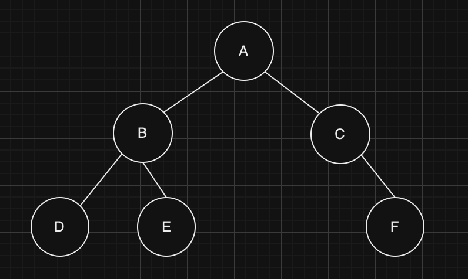
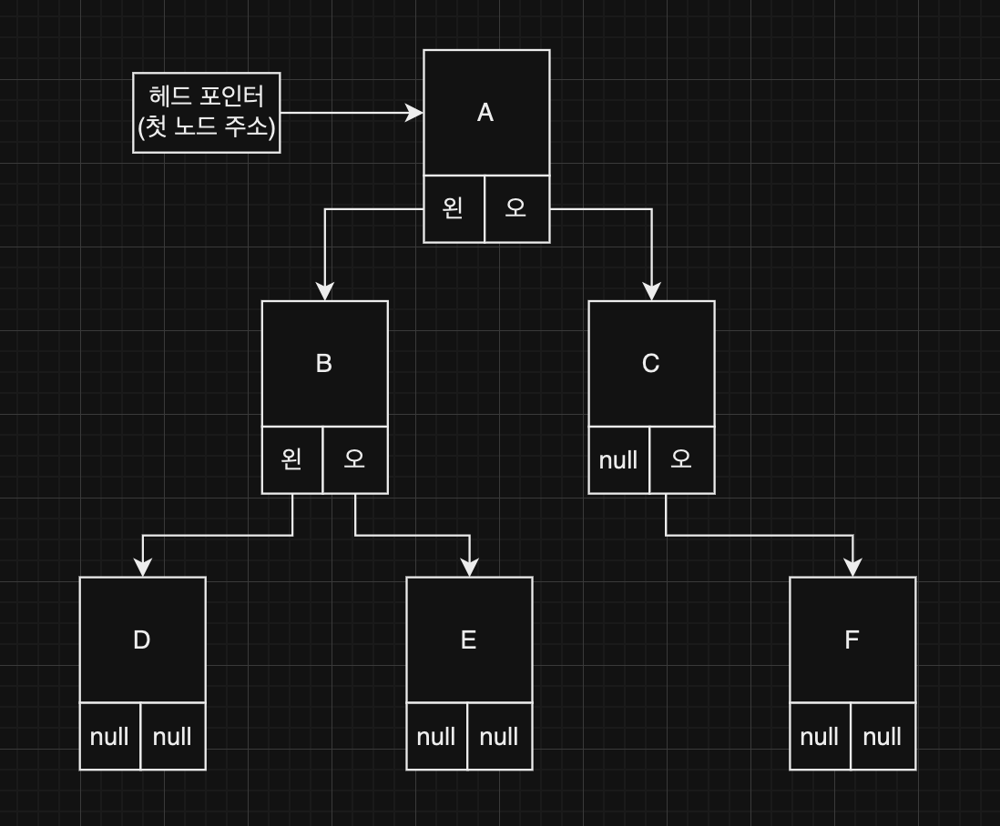

## Tree (트리)

### Tree

---

- 자료의 계층을 표현한 자료 구조
- 데이터(노드)와 연결(링크)로 구성되어 있다.
- 루프 노드 : 최상단에 위치한 노드, 하나만 존재해야 한다.
- 단말 노드 / 리프 노드 : 가장 끝에 위치한 노드(들)
- 서브 트리 : 특정 노드 선택 시에 그 노드와 아래에 있는 노드들이 또 다른 트리 구조를 이룸
- 부모 노드 : 바로 위의 상위 노드
- 자식 노드 : 바로 아래의 하위 노드
- 형제 노드 : 같은 부모를 가지는 노드
- 레벨 : 루트 노드로부터의 거리
- 깊이 : 트리의 최대 레벨

### Binary Tree (이진트리)

---

- 모든 노드들의 자식 노드가 2개 이하인 트리
- 표현   
   
    - 보통 양방향 링크드리스트(연결 리스트)를 통해 구현한다.
    - 앞 포인터 = 왼쪽 자식 포인터, 뒷 포인터 = 오른쪽 자식 포인터 영역
- 순회
    - 이진트리의 모든 노드를 특정한 순서대로 모두 한번씩 방문하는 것
    - 전위 순회 : 루트 노드 → 왼쪽 서브 트리 → 오른쪽 서브 트리
    - 중위 순회 : 왼쪽 서브 트리 → 루트 노드 → 오른쪽 서브 트리
    - 후위 순회 : 왼쪽 서브 트리 → 오른쪽 서브 트리 → 루트 노드
- 완전 이진 트리 : 단말 노드를 제외한 모든 노드가 2개의 자식 노드를 가진 트리
    - 포화 이진 트리 : 모든 노드가 채워진 트리

### 이진 탐색 트리

---

- 같은 데이터를 갖는 노드가 없다.
- 왼쪽 서브 트리에 있는 데이터가 현재 노드의 데이터보다 작다.
- 오른쪽 서브 트리에 있는 데이터가 현재 노드의 데이터보다 크다.
- 데이터의 삽입, 삭제, 검색등이 자주 발생하는 경우에 효율적인 구조이다.
- 동작
  - 검색 : Search
      - 현재 노드의 데이터가 찾으려는 데이터보다 크다면 왼쪽으로, 작다면 오른쪽으로 이동하며 찾는다.
      - 시간 복잡도 : `O(logN)`   
        정렬된 데이터로, 현재 노드 기준으로 반만 검색하면 되기 때문
  - 삽입 : Insert
      - 검색을 통해 삽입할 위치를 찾고 작다면 왼쪽에, 크다면 오른쪽에 위치시킨다.
      - 시간 복잡도 : `O(logN)`   
        검색한 후에 데이터의 연결만 변경해주면 되기 때문 (연결 리스트로 되어있는 경우)
  - 삭제 : Delete
      - 검색을 통해 삭제할 데이터를 찾고
          - 삭제할 데이터가 단말 노드인 경우, 연결된 링크를 제거한다.
          - 삭제할 데이터가 중간 노드인 경우
              - 자식이 하나인 경우, 삭제할 노드의 자식 노드를 부모 노드와 연결한다.
              - 자식이 둘인 경우, 삭제할 노드의 오른쪽 서브 트리의 가장 작은 값을 삭제할 노드의 값으로 대체하고 대체된 오른쪽 서브트리의 가장 작은 값을 삭제한다.
      - 시간 복잡도 : `O(logN)`   
        검색한 후에 데이터의 연결만 변경해주면 되기 때문 (연결 리스트로 되어있는 경우)