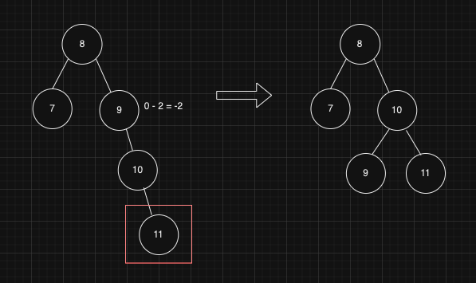

## Tree (트리)

### Tree

---

- 자료의 계층을 표현한 자료 구조
- 데이터(노드)와 연결(링크)로 구성되어 있다.
- 루트 노드 : 최상단에 위치한 노드, 하나만 존재해야 한다.
- 단말 노드 / 리프 노드 : 가장 끝에 위치한 노드(들)
- 서브 트리 : 특정 노드 선택 시에 그 노드와 아래에 있는 노드들이 또 다른 트리 구조를 이룸
- 부모 노드 : 바로 위의 상위 노드
- 자식 노드 : 바로 아래의 하위 노드
- 형제 노드 : 같은 부모를 가지는 노드
- 레벨 : 루트 노드로부터의 거리
- 깊이 : 트리의 최대 레벨

### Binary Tree (이진트리)

---

- 모든 노드들의 자식 노드가 2개 이하인 트리
- 순회
    - 이진트리의 모든 노드를 특정한 순서대로 모두 한번씩 방문하는 것
    - 전위 순회 : 루트 노드 → 왼쪽 서브 트리 → 오른쪽 서브 트리
    - 중위 순회 : 왼쪽 서브 트리 → 루트 노드 → 오른쪽 서브 트리
    - 후위 순회 : 왼쪽 서브 트리 → 오른쪽 서브 트리 → 루트 노드
- 정 이진 트리
    - 모든 노드가 2개의 자식 or 자식을 가지지 않은 트리 (자식이 하나인 노드가 없어야 함)
- 포화 이진 트리
    - 모든 노드가 채워진 트리
    - 단말 노드의 레벨이 모두 같은 트리
- 완전 이진 트리
    - 마지막 레벨을 제외하고 모든 노드가 채워져 있는 트리 (왼쪽 노드만 있는 것도 채워진 것으로 간주됨)
    - 오른쪽 노드를 가지고 있다면 왼쪽 노드도 가지고 있어야 한다. (왼쪽에서 오른쪽으로 채워지기)
- 표현
    - 배열  
      
    - 레벨 순서 순회 방식(위에서 아래, 왼쪽에서 오른쪽)에 따라 각 노드를 배열에 저장한다.
    - 일반적으로 루트 노드를 1번으로 하여 배열의 인덱스도 이와 맞춰 저장한다.
      - 비어있는 값은 NULL 로 표현한다.

        - 연결 리스트  
          
            - 보통 양방향 링크드리스트(연결 리스트)를 통해 구현한다.
            - 앞 포인터 = 왼쪽 자식 포인터, 뒷 포인터 = 오른쪽 자식 포인터 영역

### 이진 탐색 트리

---

- 같은 데이터를 갖는 노드가 없다.
- 왼쪽 서브 트리에 있는 데이터가 현재 노드의 데이터보다 작다.
- 오른쪽 서브 트리에 있는 데이터가 현재 노드의 데이터보다 크다.
- 데이터의 삽입, 삭제, 검색등이 자주 발생하는 경우에 효율적인 구조이다.
- 동작
    - 검색 : Search
        - 현재 노드의 데이터가 찾으려는 데이터보다 크다면 왼쪽으로, 작다면 오른쪽으로 이동하며 찾는다.
        - 시간 복잡도 : `O(logN)`   
          정렬된 데이터로, 현재 노드 기준으로 반만 검색하면 되기 때문
    - 삽입 : Insert
        - 검색을 통해 삽입할 위치를 찾고 작다면 왼쪽에, 크다면 오른쪽에 위치시킨다.
        - 시간 복잡도 : `O(logN)`   
          검색한 후에 데이터의 연결만 변경해주면 되기 때문 (연결 리스트로 되어있는 경우)
    - 삭제 : Delete
        - 검색을 통해 삭제할 데이터를 찾고
            - 삭제할 데이터가 단말 노드인 경우, 연결된 링크를 제거한다.
            - 삭제할 데이터가 중간 노드인 경우
                - 자식이 하나인 경우, 삭제할 노드의 자식 노드를 부모 노드와 연결한다.
                - 자식이 둘인 경우, 삭제할 노드의 오른쪽 서브 트리의 가장 작은 값을 삭제할 노드의 값으로 대체하고 대체된 오른쪽 서브트리의 가장 작은 값을 삭제한다.
        - 시간 복잡도 : `O(logN)`   
          검색한 후에 데이터의 연결만 변경해주면 되기 때문 (연결 리스트로 되어있는 경우)
    - 계속 현재 값보다 큰 값이 들어오거나, 작은 값이 들어와 트리가 한쪽으로 편향되는 경우, 시간복잡도는 O(n)이 될 수 있디.
        - 트리의 균형을 맞추는 것이 중요하다.

### Balanced Binary Tree, 균형 이진 트리

---

- 모든 단말 노드의 깊이 차이가 1 이하인 트리
- 일반적으로 이진 탐색 트리의 특성을 가지고 있고, 균형이 맞춰져 있기 때문에   
  검색, 삽입, 삭제의 시간복잡도는 로그시간인 O(logN) 이다.
- 종류
    - AVL Tree
        - 중간 노트를 기준으로 왼쪽 서브트리와 오른쪽 서브트리의 높이 차이가 항상 1 이하로 유지된다.
        - 삽입, 삭제 후 트리의 균형을 유지하기 위해 회전 연산을 사용한다.
        - 검색, 삽입, 삭제의 시간복잡도는 로그시간으로 동일하지만   
          회전 연산을 위한 구현이 복잡할 수 있다.
        - 트리의 균형은 각 노드의 균형 인수(Balance Factor)를 통해 측정할 수 있다.
            - `BF(균형인수)` = `왼쪽 서브트리의 높이` - `오른쪽 서브트리의 높이`
                - 높이란 기준이 되는 노드의 가장 깊은 깊이를 의미한다.
            - BF가 `-1`, `0`, `1` 이라면 균형 잡힌 상태이다.
            - BF가 이를 벗어나는 경우 균형이 깨진 상태라 판단하고, 균형을 위해 회전 연산을 진행한다.
        - 회전 연산
            - 회전 연산의 시간복잡도는 상수시간 O(1)이다.
                - 연결리스트인 경우에는 링크 변경을, 배열인 경우에는 서로 위치를 교환하면 되기 때문이다.
            - LL(좌좌)회전  
              
                - 한 노드의 왼쪽 서브트리가 오른쪽 서브트리보다 2레벨 이상 높을 때 발생한다.
                - 불균형 노드를 기준으로 오른쪽으로 회전한다.
            - RR(우우)회전  
              
                - 한 노드의 오른쪽 서브트리가 왼쪽 서브트리보다 2레벨 이상 높을 때 발생한다.
                - 불균형 노드를 기준으로 왼쪽으로회전한다.
            - LR(좌우)회전  
              
                - 한 노드의 왼쪽 서브트리가 오른쪽 자식의 왼쪽 서브트리보다 높을 때 발생한다.
                - 왼쪽 서브트리를 먼저 RR회전을 수행한 후, LL회전을 수행한다.
            - RL(우좌)회전  
              
                - 한 노드의 오른쪽 서브트리가 왼쪽 자식의 왼쪽 서브트리보다 높을 때 발생한다.
                - 오른쪽 서브트리를 먼저 LL회전을 수행한 후, RR회전을 수행한다.
    - Red-Black Tree
        - 규칙
            - 각 노드는 Red 또는 Black 의 색을 가진다.
            - 루트 노드는 항상 Black 이다.
            - 모든 리프 노드는 Black 이다.
            - Red 노드의 자식 노드는 모두 Black 이다. (Red 노드는 연속으로 나타날 수 없다.)
            - 리프 노드에서 루프 노드로 가는 경로에는 같은 개수의 Black 노드가 있어야 한다.
        - 노드 삽입 시에 새로운 노드는 항상 Red 노드이다.
        - 삽입을 진행하며 위의 규칙이 깨지는 경우엔 회전 OR 색상 변경을 통해 균형을 맞춘다.  
          
            - 삽입하려는 노드가 단말 노드가 되면서 아래 2가지 규칙이 깨짐
                - 단말 노드가 Black 노드 → Red 노드가 됨
                - 루트 노드까지의 경로에 Black 노드 개수가 같아야 함 → 왼쪽 단말 노드부터는 0개, 오른쪽 단말 노드부터는 1개가 됨
            - 회전
                - 10 노드를 기준으로 오른쪽 서브트리의 균형을 위해 RR회전을 진행한다.
            - 색상 변경
                - 회전 후, 단말 노드가 레드이고, 경로의 Black 의 같은 수를 위해 색상을 변경한다.

> AVL Tree : 탐색에 유리함 (균형을 좀 더 엄격하게 관리)  
> Red-Black Tree : 삽입, 삭제에 조금 더 유리함