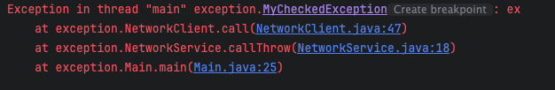

## 예외처리

* * *

- 프로그램 실행 중 발생할 수 있는 예상치 못한 상황, 예외를 처리하기 위한 매커니즘을 제공한다.
- `Throwable`: 최상위 예외
    - `Error`: 시스템 예외
        - 메모리 부족, 심각한 시스템 오류 등
        - 개발자가 직접 처리하지 않는다.
        - ex.`OutOfMemory`
    - `Exception`: 체크 예외
        - `RuntimeException`: 런타임 예외, 언체크 예외
    - 애플리케이션 로직에서는`Throwable`타입으로 예외를 잡으면 안된다.
        - 시스템 에러까지 함께 잡히기 때문

    
### Exception

* * *

- 컴파일러가 예외의 처리를 체크한다.
- `Exception`으로 정의하면 하위 타입의 예외를 함께 처리할 수 있다. (다형성)
- 명시적으로 처리해 주어야 한다.
    ```
    public void callCatch() {
        try {
            client.call();
        } catch (MyCheckedException e) {
            System.out.println("예외처리 : " + e.getMessage());
        }
        System.out.println("정상 흐름");
    }
    
    public void callThrow() throws MyCheckedException {
        client.call();
    }
    ```
    - 예외를 처리해서 정상적인 흐름으로 돌리거나 (`catch`)
        - `catch`블럭을 여러개 정의하는 경우, 하위 예외가 상위 예외보다 앞에 존재하도록 해야 한다.
        - 여러 예외를 한 번에 잡을 때 | 를 통해 구분하여 사용할 수 있다.

    ```
    try {
        client.connect();
        client.send(data);
    } catch (ConnectException | SendException e) {
        System.out.println("[오류 메시지] : " + e.getMessage());
    } finally {
        client.disconnect();
    }
    ```
    - 처리하지 못해서 밖으로 던지거나(`throws`) 둘 중 하나로 선택해야 한다.

        - 발생은`throw`, 던지는 것은`throws⁠`
    - 발생한 에러를 처리하지 않으면 컴파일 오류가 발생한다.

- 장점
    - 실수로 예외를 누락하지 않도록 컴파일러가 미리 잡아준다.
- 단점
    - 모든 예외를 처리해야 하기 때문에 너무 번거로운 일이 된다.


### RuntimeException

* * *

- 컴파일러가 예외를 미리 체크하지 않는다.
- 예외를 잡아 처리하지 않아도 자동으로 던져진다. (`throws`를 생략할 수 있다.)
    ```
    public void callCatch() {
        try {
            client.call();
        } catch (MyUnCheckedException e) {
            System.out.println("예외처리 : " + e.getMessage());
        }
        System.out.println("정상 흐름");
    }
    
    public void callThrow() {
        client.call();
    }
    ```
    - 생략하지 않으면, 예외가 발생한다는 것을 알 수는 있지만 컴파일 시에 체크되진 않는다.
- 장점
    - 신경쓰고 싶지 않은 예외를 무시할 수 있다.
- 단점
    - 예외를 실수로 누락할 수 있다.


### 예외 확인

* * *

- `main()`밖으로 예외를 던지면 로그를 출력하면서 시스템이 종료된다.
    
    - Stack Trace를 통해 예외가 어디에서 발생했는지(경로)와 메시지를 확인할 수 있다.


### finally

* * *
```
try {
    client.connect();
    client.send(data);
} catch (NetworkException e) {
    System.out.println("코드 : " + e.getErrorCode() + ", 메시지 : " + e.getMessage());
} finally {
    client.disconnect();
}
```

- 반드시 호출되는 기능이다.
- 잡을 수 없는 예외가 발생하더라도 호출된다.
- 마무리 흐름을 제공한다.
- 주로`try{}`에서 사용한 자원을 해제할 때 발생한다.
- 정상 흐름 - 예외 흐름을 분리하여 코드의 가독성을 높인다.
- 사용한 자원을 항상 반환할 수 있도록 보장한다.


### 예외의 계층처리

* * *

- 예외를 계층화하면
    - 상위 타입으로 하위 예외를 처리할 수 있다.
    - 특정 예외만을 처리할 수 있다.


### 실무에서의 예외처리

* * *

- 처리할 수 없는 예외가 많아 주로`RuntimeException`으로 처리한다.
    - 통신 불가능, 데이터베이스 접속 불가능, 네트워크 연결 실패 등

    - 실제 처리할 수 없는 오류가 너무 많다.
        - 여러 외부 라이브러리를 사용하기도 하고, 프로그램이 복잡해지면 예측할 수 없는 오류들이 많이 발생할 수 있다.

    - 체크 예외를 사용했으면 미리 잡을 수 있어서 좋았겠지만, 프로그램이 복잡해지면서 체크 예외를 사용하는 것이 복잡하고 부담스러워졌다.
        - 예외를 처리할 수 없기 때문에, 던져야 하는데 끊임없이 던지는 코드들이 늘어날 수 있다.
        - 가장 부모 타입인`Exception`을 사용하면?
            - 중요한 체크 예외가 발생해도, 놓치게 된다. → 모든 예외 체크 기능이 무효화된다.

    - 언체크 예외로 예외를 밖으로 던진다.
        - 예외를 공통으로 처리할 수 있는 곳을 만들어서 처리한다.
        - 로그를 남겨 기록하고, 오류 메시지를 노출시킨다.
            - `e.printStackTrace()`: 콘솔에 stack trace 출력


### try-with-resources

* * *

- 외부 자원을 반납하는 반복적인 작업을 편하게 처리하기 위해 자바 7부터 도입되었다.
- finally 에서 자원을 직접 반납하는 작업을 해주지 않아도 된다.

```
public class NetworkClient implements AutoCloseable {
    @Override
    public void close(){
        disconnect();
    }  
}
```

```
try (NetworkClient client = new NetworkClient(address)){
    client.initError(data);
    client.connect();
    client.send(data);
}
```

- `AutoCloseable`인터페이스를 구현하고,`close()`함수 안에 반납할 자원의 처리를 정의한다.
- `try`블럭에서 괄호 안에 사용할 자원을 명시한다.
- `try`블럭이 끝나는 시점에`close()`가 실행된다.


- 장점
    - 코드가 더 간결하고 읽기 쉬워진다.
    - 사용하는 리소스의 스코프를 한정하여 유지보수가 더 용이해진다.
    - `finally`블록의 누락을 방지할 수 있다.
    - `finally`보다 자원을 더 빨리 해제한다.
        - `try`→`catch`→`finally`
        - `try`→`close()`