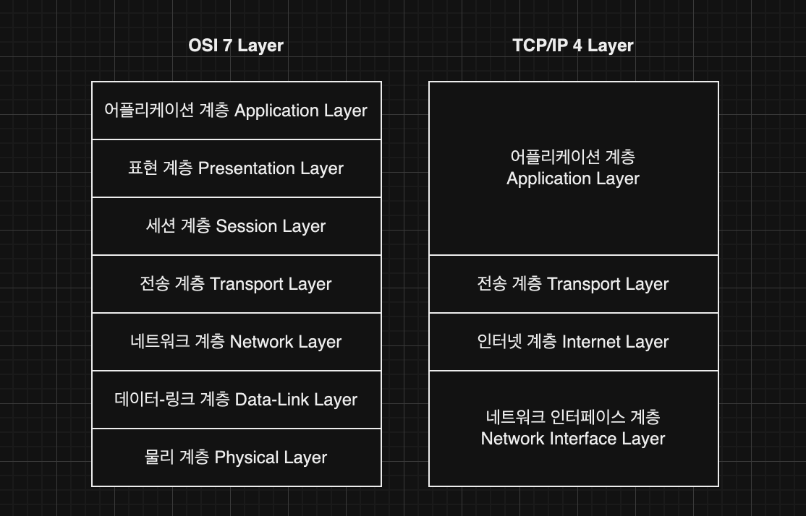

## 네트워크

### 네트워크 계층 (Layer)

* * *

- 네트워크 전송 과정을 계층으로 구분하고 각각의 계층에서 사용될 규칙(프로토콜)을 따라 데이터를 통신한다.

- 종류
    - OSI 7계층
    - TCP/IP 4 계층
    - 현재는 OSI 7 계층의 5-6-7계층을 하나의 계층으로,1-2계층을 하나의 계층으로 하는 TCP/IP 4계층을 주로 사용한다.

- 발신 측에서는 위의 계층부터 아래 계층으로 내려가면서 원본 데이터에 각 계층의 헤더를 추가하고(**캡슐화**),   
  수신 측에서는 아래 계층부터 위의 계층으로 올라가면서 받은 데이터의 헤더를 하나씩 벗겨가면서(**비캡슐화**) 원본 데이터를 확인한다.

- 계층 구조의 장점
    - 각 계층별로 역할이 구분되어 있어, 문제 발생 시 하나의 계층 부분만 확인하면 된다.
    - 자신의 계층 부분만 담당하면 되기에 설계도 편리하다.

- 계층
    - 1계층 (`Physical Layer`)
        - 디지털 신호를 아날로그 신호를 변환하려 전달하고, 아날로그 신호를 받아 디지털 신호로 변환하여 해석한다.
        - 전기적인 신호가 나가고 들어오는 것만을 담당한다.
        - 하드웨어에 구현되어 있다.

    - 2계층 (`Data-Link Layer`)
        - 데이터 전송 흐름과 오류, 순서를 제어한다.
        - 앞뒤에 특정 비트열을 붙여 데이터를 구분할 수 있게 한다. (Frame)
        - 하드웨어에 구현되어 있다. (스위치, 랜카드)

    - 3계층 (`Network Layer`)
        - 데이터의 목적지를 지정하고, 빠르게 전송한다.
        - IP (인터넷 프로토콜)
            - 패킷이라는 통신 단위를 빠르게 목적지로 전달하는 역할
            - IP 주소 : 목적지 주소 (각 컴퓨터의 고유한 주소)
            - IP의 한계
                - 비연결성
                    - 받을 대상이 없거나 불능이어도 그냥 보낸다.
                - 비신뢰성
                    - 패킷이 사라지거나(유실)
                    - 순서대로 오지 않아도 다시 보내지 않는다.
                - 이를 보완하기 위한 프로토콜인 ICMP (Internet Control Message Protocol)가 있다.
                    - 패킷 오류 시 출발지에 알려 재전송하게 하고, ping 커맨드를 통해 도착지와의 통신을 확인한다.
        - 패킷
            - 데이터 + 어플리케이션헤더 + TCP헤더 + IP헤더(출발지/목적지 주소)
        - 운영체제의 커널에 소프트웨어 적으로 구현되어 있다.
    - 4계층 (`Transport Layer`)
        - 목적지의 어떤 어플리케이션에 데이터를 전송할지 지정한다.
            - 헤더에 출발지 port, 도착지 port를 포함한다.
        - port
            - 하나의 컴퓨터에서 동시에 실행되고 있는 여러개의 프로세스들이 고유하게 가져야 하는 번호
            - 16비트길이, (0~65535)
            - 미리 등록된 포트번호와 동적으로 사용 가능한 포트 번호로 나뉜다.
                - http:80, https:443
        - 오류 검충 밒 복구, 흐름 제어와 중복 검사 등을 수행한다.
        - 운영체제의 커널에 소프트웨어 적으로 구현되어 있다.
        - 프로토콜 종류
            - TCP (전송 제어 프로토콜)
            - UDP (사용자 데이터그램 프로토콜)
    - 5계층 (`Session Layer`)
        - 응용 프로세스가 통신을 관리하기 위한 방법을 정의한다.
        - TCP/IP 세션을 만들고 없애는 역할이다.
    - 6계층 (`Presentation Layer`)
        - 전송하는 데이터의 표현 방식(암호화, 데이터변환, 압축 등)을 결정한다.
    - 7계층 (`Application Layer`)
        - 실제 어플리케이션에서 데이터를 주고 받는 시작/끝점이다.
        - HTTP
            - 웹에서 정보를 주고 받을 수 있는 프로토콜
        - FTP
            - TCP 환경에서의 파일 전송 프로토콜

### IP 주소

* * *

- 인터페이스와 IP의 프로토콜 부분을 연관지어 IP 주소를 설정한다.
    - 인터페이스
        - 각 기기에서 실제 데이터를 수발신하는 네트워크 포인트를 말한다.
        - 하나의 기기에는 복수의 인터페이스가 존재할 수도 있으며, 이들은 각각의 IP 주소를 가진다. (무선LAN, 이더넷)
        - 실제로 IP는 호스트(기기) 자체를 식별하는 것이 아니라, 호스트의 각각의 인터페이스를 식별하는 것이다.

- 길이는 32비트로, 8비트씩 10진수로 변환하고 . 으로 구분하여 사용한다.
    - .으로 구분되는 각 단위를 Octet(옥텟)이라고 부른다.
    - 8비트 10진수는 0~255 사이이므로 하나의 옥텟은 그 범위의 수를 가진다.

- IP 주소의 부족으로 모든 기기의 인터페이스가 고유한 IP를 가질 수 없다.
- 공인 IP
    - 인터넷에서 사용하는 IP 주소이다.
- 사설 IP
    - 사설 네트워크 안에서 사용하는 IP 주소이다.
    - 다른 사설 네트워크의 IP와 중복되더라도 괜찮다.
    - 사설 IP로는 인터넷과 통신할 수 없기 때문에, NAT(Network Address Translation)을 통한 변환이 필요하다.
        - 사설 IP로 인터넷에 요청은 보낼 수 있지만, 응답은 받을 수 없다.
        - NAT를 통해 사설 ip를 공인 ip로 변환한다.
- NAT
    - 역할
        - 기본적으로 IP를 변환하는 데 사용된다.
            - 공인 IP/사설 IP 간의 전환에 사용된다.
            - 외부에서의 접근을 막는 등의 보안을 강화하는 데 사용되기도 한다.
            - 공인 IP 주소를 효율적으로 관리하고 할당한다.
            - 라우터에서 진행된다.
    - 동작 원리
        - 정적 NAT
            - 특정한 사설 ip를 특정 공인 ip로 변경하는 방식이다.
            - 웹서버, 메일 서버와 같이 외부에서 접근해야 하는 서비스에 사용된다.
            - 고정되어 있기 때문에 안정적이고 예측이 가능하다.
        - 동적 NAT
            - 사용 가능한 공인 IP 풀에 동적으로 IP 주소를 할당하여 변경하는 방식이다.
            - 네트워크 내에서 동시에 접속하는 디바이스의 수가 제한적일 때 사용한다.
            - 주로 ISP (인터넷 서비스 제공업체)가 관리하면서 ip를 할당한다.
            - 내부에서 외부로 요청 시에 일시적으로 IP를 할당받기에
              외부에서 해당 공인 IP를 사용해 내부에 접근할 수 없다.
        - PAT / NAPT
            - 하나의 공인 IP 주소를 함께 사용하고, 포트 번호를 할당받아 변경하는 방식이다.
            - 여러 개의 사설 IP를 하나의 공인 IP로 연결할 수 있다.
            - 포트는 일반적으로 사설 IP의 포트와 맞추지만, 이미 사용 중이라면 다른 포트와 매핑한다.
            - 매핑 정보는 라우터에 NAT 테이블에 기록된다.
            - 내부에서 외부로 요청하고 응답을 받으면, 할당된 포트 번호를 반환한다.
                - 포트 번호가 고정되지 않기에 외부에서 내부로의 접근은 어렵다.
            - 외부에서 내부로 접근하게 하려면 추가적인 설정이 필요하다.

- 유니캐스트
    - 하나의 호스트에 데이터를 전송하는 것이다.- 유니캐스트 IP를 사용한다.
    - TCP/IP에서 사용하는 대부분은 유니캐스트 IP이다. (PC, 서버)

- 브로드캐스트
    - 같은 네트워크의 모든 호스트에 데이터를 전송하는 것이다.
    - 브로드캐스트 IP를 사용한다.
- 멀티캐스트
    - 특정 그룹에 포함되는 호스트에 데이터를 전송하는 것이다.
    - 멀티캐스트 IP를 사용한다.

- IP 주소는 전반의 네트워크부와 후반의 호스트부로 구성되어 있다.
    - 네트워크부와 호스트부의 길이는 가변적이기 때문에 각각의 길이를 서브넷 마스크를 통해 확인한다.
    - 연속된1의 개수만큼이 네트워크부, 연속된 0의 개수만큼이 호스트부 이다.

        - 255.255.0.0 (앞의 두 옥텟이 네트워크부, 뒤의 두 옥텟이 호스트부)
        - 255.192.0.0 (앞의 하나의 옥텟과 두번째 옥텟의 2개의 비트가 네트워크부, 그 뒤에가 호스트부)
            - 255.255.0.0 보다 255.192.0.0 에서 더 많은 IP 주소를 표현할 수 있게 된다.

    - 호스트부를 모두 0으로 채우면 네트워크 자체를 나타내는 네트워크 주소가 된다.
    - 호스트부를 모두 1로 채우면 브로드캐스트 주소가 된다.

- 네트워크 접속의 의미
    - 물리적 접속 : 실제로 선을 연결되거나, 무선으로 연결된다.
    - 논리적 접속 : IP를 할당받는다. (DHCP를 사용하여 보통은 물리적 접속시에 함께 자동으로 접속된다.)

- ARP(Address Resolution Protocol)
    - IP 주소(논리적인 주소)를 MAC주소(물리적인 주소)와 매핑한다.
    - 동일 네트워크 내부에서는 MAC 주소를 매핑하여 사용한다.
    - 외부 네트워크와의 통신에서는 라우트를 지나 전송되기에,라우트에 연결된 동일 네트워크 안에서만 사용된다.

### TCP : Transmission Control Protocol

* * *

- 도착한 데이터 조각을 점검하여 줄을 세우고, 망가졌거나 빠진 조각을 다시 요청한다.

- 신뢰성이 보장된다.

- TCP 세그먼트의 형태로 전송된다.
    - 데이터 + 어플리케이션헤더 + TCP 헤더
    - 데이터의 크기가 크면 여러개의 TCP 세그먼트로 분할하고, 분할 정보를 TCP 헤더에 추가하여 전송할 수도 있다.

- 3 way handshaking 을 사용한다.
    - 실제 데이터를 보내기 전에 가상 연결을 통해 연결을 확인하는 전송을 보장한다.
    - 1\. SYN(synchronize)
        - 클라이언트에서 연결을 요청한다.
    - 2\. SYN + ACK(acknowledgment)
        - 확인 응답과 함께 서버 또한 연결을 요청한다.
    - 3\. ACK
        - 클라이언트가 확인 응답을 보내며 연결이 완료된다.
        - 연결 이후에 데이터를 전송하며, 마지막 ACK 와 함께 데이터를 전송할 수도 있다.
    - 실제로 어떤 랜선이나 경로가 확실히 보장되는 것은 아니며, 논리적으로 연결이 되었다고 판단하는 것이다.

- 수신 ACK
    - 데이터를 전송한 후 잘 받았는지를 확인한다.

- 응답 또한 TCP 세그먼트의 형태로 전송된다.

- 데이터의 안정적인 전송을 보장하기 위한 매커니즘
    - 흐름 제어 (Flow Control)
        - 데이터를 수신하는 속도를 제어하는 매커니즘이다.
        - 송신자가 너무 많은 데이터를 보내 수신자가 처리할 수 없게 되는 경우(오버플로우)를 방지한다.
        - 처리
            - 수신자가 송신자에게 자신이 처리할 수 있는 데이터의 양(윈도우)를 알려준다.
                - TCP 세그먼트의 헤더 부분에 윈도우 크기를 담아 전송한다.
                - 처음 데이터를 수신하고, 확인 응답으로 윈도우 크기를 전달하여 다음번부터 데이터의 양을 조정할 수 있게 한다.
            - 송신자는 이를 확인하고 다음부터 해당 크기 이상의 데이터를 전송하지 않는다.
            - 데이터를 받고 처리할 때마다 새로운 윈도우 크기를 업데이트한다.
    - 혼잡 제어 (Congestion Control)
        - 네트워크의 혼잡 상태를 감지하고 조절하여 네트워크의 안정성과 성능을 유지하는 메커니즘이다.
        - TCP 세그먼트의 손실을 감지하고, 데이터 전송 속도를 조절하여 네트워크 혼잡을 완화한다.
        - 처리
            - AIMD 알고리즘
                - 가산적 증가(Additive Increase)
                    - 윈도우 크기 내에서 크기를 조금씩 늘려가면서 전송한다.
                    - 혼잡이 완화 되었을 때, 조금씩 속도를 높인다.- 곱셈적 감소(Multiplicative Decrease)
                    - 혼잡을 감지하면 윈도우의 크기를 절반으로 줄인다.
                    - 혼잡이 발생했을 때, 한 번에 속도를 낮춘다.
            - Slow Start 알고리즘
                - 처음에 윈도우 크기를 작게 설정하여 전송한다. (1 or 2)
                - ACK를 수신할 때마다 윈도우 크기를 지수적으로 증가시킨다.
                - 윈도우 크기가 임계값에 도달(Congestion Avoidance 상태)하면 선형적으로 증가하면서 속도를 제한한다.

### UDP (사용자 데이터그램 프로토콜)

* * *

- TCP 처럼 데이터 전송과 순서를 보장하지는 않는다.
- 데이터 전송 효율이 좋다. (빠르다.)
- 신뢰성은 높지 않다. (유실될 가능성이 있다.)
- UDP 데이터그램 형태로 전송된다.
    - 데이터 + 어플리케이션헤더 + UDP 헤더
- 전송확인이나 데이터 분할과 같은 기능이 필요하다면 어플리케이션에서 구현해야 한다.
- 음성, 영상 데이터를 주로 전송한다.
- 직접 최적화 할 수 있다.
- HTTP/3 에서 UDP 를 사용하면서 각광받고 있다.

### UDP / TCP 비교

* * *

- 사용
    - TCP
        - 웹 브라우저에서의 요청, 이메일 전송, 파일 전송
    - UDP
        - 실시간 스트리밍, DNS조회, 음성 전송

- 장점
    - TCP
        - 순서 변경, 손실등에 대한 대응으로 인해 신뢰성 있는 데이터 전송이 가능하다.
        - 흐름제어, 혼잡 제어를 통한 네트워크 혼잡 완화한다.
    - UDP
        - 오버헤드가 적기 때문에 TCP 보다 빠른 전송이 가능하다.
            - 미리 전송을 위해 연결을 맺거나, 전송 후 응답과 같은 동작이 없다.
        - 간단한 프로토콜이기에 구현이 쉽다.

- 단점
    - TCP
        - 신뢰성을 가지기 위해 추가적인 오버헤드가 발생할 수 있고, 이로 인해 더 많은 대역폭을 사용한다.
            - 오버헤드
                - 전송되는 데이터 외에 발생하는 부가적인 부담
                - TCP에서는 헤더나 에러 검출/복구, 흐름/혼잡 제어 등이 필요하다.
        - 미리 연결을 맺고, 오류에 대응하고, 흐름 및 혼잡을 제어하는 동작들로 인해 UDP 보다 속도가 느릴 수 있다.
    - UDP
        - 패킷 손실이나 순서 변경에 대응하지 않기 때문에 데이터의 신뢰성을 보장할 수 없다.
        - 네트워크 혼잡을 제어하는 기능이 없기 떄문에, 혼잡한 네트워크에서는 전송이 지연될 수 있다.

### 이더넷

* * *

- 네트워크 인터페이스 계층에 해당하는 프로토콜이다.
- 같은 네트워크 내의 한 이더넷 인터페이스에서 다른 인터페이스로의 전송을 담당한다.
- 이더넷 인터페이스끼리 연결하면, 유선 네트워크가 된다.
- MAC 주소
    - 이더넷 인터페이스를 특정하기 위한 48비트 주소
    - 48비트의 앞 24비트는 OUI주소(각 인터페이스를 제조하는 제조사 식별 코드),뒤 24비트는 시리얼넘버(각 제조사에서 할당하는 숫자)로 되오았다.
    - 이더넷 인터페이스에 미리 할당되어 있어 변경할 수 없는 고유 값이며, 물리 주소/하드웨어 주소 라고도 부른다.
- 이더넷 프레임: 이더넷 헤더(출발지 MAC주소 + 도착지 MAC주소 + 타입 코드)와 FCS(에러 체크용)
- 레이어2 스위치
    - 이더넷을 이용한 네트워크 하나를 구성하는 네트워크 기기이다.
    - 레이어2 스위치는 네트워크의 입구이므로 엑세스 스위치, 스위칭 허브라고도 부른다.
    - 레이어2 스위치가 여러개 있어도 하나의 네트워크이다.
    - 이더넷 프레임의 출발지 MAC 주소를 MAC주소 테이블에 저장한다.

### 무선 LAN

* * *

- 케이블 없이도 간편하게 LAN을 구축할 수 있는 기술이다.
- 무선 LAN 엑세스 포인트와 무선 LAN 인터페이스가 필요하다.
- 대부분의 노트북, 컴퓨터, 스마트폰, 태블릿 등에 미리 내장되어 있다.
    - 무선 LAN 클라이언트라 부른다.
- 무선 LAN 엑세스 포인트를 거쳐 데이터가 전송되며, 보통 이더넷 네트워크와도 연결되어 있다.

### 라우팅

* * *

- 다른 네트워크에 데이터를 보내려면 네트워크를 서로 연결하는 라우터를 사용해야 한다.
- 데이터의 목적지가 어느 네트워크에 접속해 있는지를 판단하여 연결된 네트워크의 라우터로 전송한다.
- 라우팅을 반복하면 멀리 떨어진 네트워크라도 데이터를 전송할 수 있다.
- 라우터의 전송 대상은 IP 패킷이다. → 인터넷 계층에서 이루어진다.
- 이더넷 헤더 등 네트워크 인터페이스층의 프로토콜 헤더는 라우터가 전송시에 완전히 새로운 헤더로 교체된다.
    - 같은 네트워크 상에서 라우터까지 보내기 위해 사용하는 것이기 때문이다.